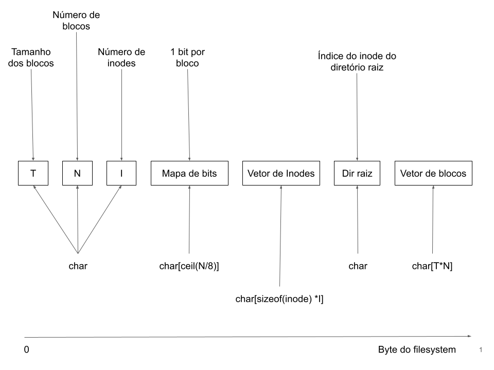

# TrabalhoT (simulador padrão EXT3) 
* Desenvolvido para a disciplina de Arquiteturas de sistemas operacionais - UFSC 

* A ideia inicial é um sistema de arquivos que simula padrão EXT3. 
O sistema foi desenvolvido em C++ utilizando o compilador GNU GCC e chamadas de sistemas do padrão POSIX. 

* A tarefa imposta consiste em manipular um arquivo em disco cujo conteúdo simula um sistema de arquivo EXT3. 
Este arquivo deve está no formato especificado abaixo. A aplicação será testada com conjunto de testes unitários disponíveis no arquivo main.cpp utilizando a biblioteca OpenSSL e Google Test.

## Como compilar e rodar
1º- O primeiro CERTIFIQUE-SE que o compilador seja **GNU GCC**;

2º- Instale todas as bibliotecas necessárias;

3º- Compile os arquivos main.cpp e fs.cpp com o seguinte comando **g++ main.cpp fs.cpp -o main -lpthread**

4º- Rode o arquivo main.

## Arquitetura do arquivo

